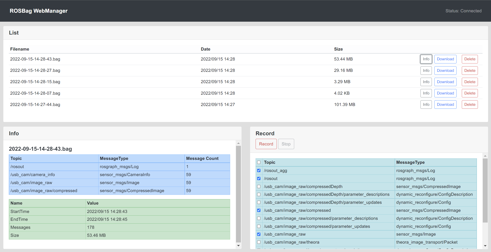

# web_rosbag_manager

[English](README_en.md) | [日本語](README.md)



## セットアップ方法
```
sudo python3 -m pip install Flask websocket-server
cd ~/catkin_ws && catkin build && catkin source
```

## 使い方
```
roslaunch web_rosbag_manager web_rosbag_manager.launch
```

ウェブブラウザから `http://$IPアドレス:8080/` にアクセスします。
`$IPアドレス` はlaunchファイルを実行しているPCのIPアドレスを指定します。

### 記録
1. 右下の「Record」パネルから記録したいトピックを☑で選択
2. 「Record」ボタンを押して記録を開始
3. 「Stop」で記録を停止

### メタ情報の確認
1. 上の「List」パネルから確認したいファイルの「Info」ボタンを押す
2. 左下の「Info」パネルに詳細なメタ情報が表示される

### ダウンロード
1. 上の「List」パネルからダウンロードしたいファイルの「Download」ボタンを押す

### 削除
1. 上の「List」パネルから削除したいファイルの「Delete」ボタンを押す
2. 確認画面が表示されるので、問題無ければOKボタンを押す


## ライセンス

```
Copyright 2021-2022 Work Robotics Co., Ltd.

Licensed under the Apache License, Version 2.0 (the "License");
you may not use this file except in compliance with the License.
You may obtain a copy of the License at

    http://www.apache.org/licenses/LICENSE-2.0

Unless required by applicable law or agreed to in writing, software
distributed under the License is distributed on an "AS IS" BASIS,
WITHOUT WARRANTIES OR CONDITIONS OF ANY KIND, either express or implied.
See the License for the specific language governing permissions and
limitations under the License.
```

本ソフトウェアは、[Apache License, Version 2.0](https://licenses.opensource.jp/Apache-2.0/Apache-2.0.html)に基づき公開しています。ライセンスの全文は[LICENSE](./LICENSE)から確認できます。
本ソフトウェアは、 あらゆるすべての種類の保証も責任を伴わない現状有姿で提供されるものとします。

See [THIRD-PARTY-NOTICES.md](./THIRD-PARTY-NOTICES.md) for other third party resources.
